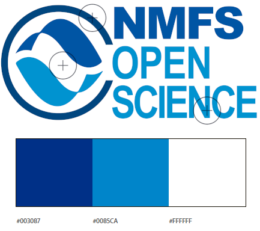
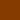
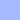
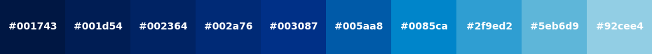
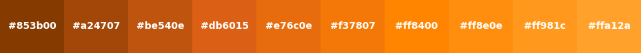
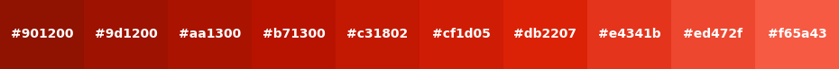
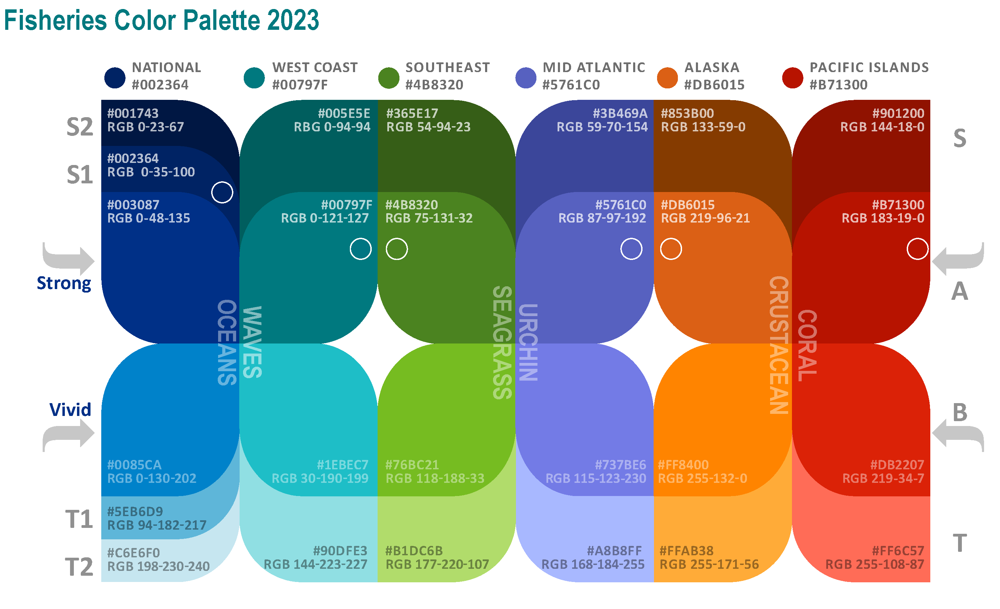
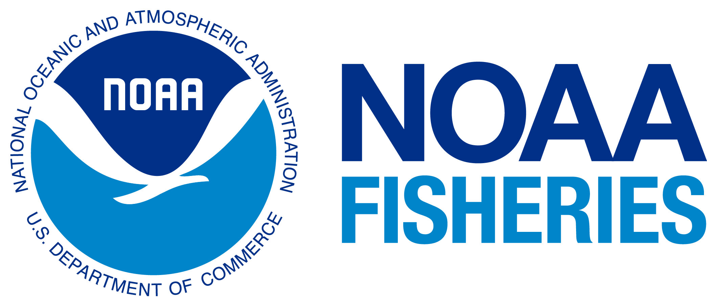
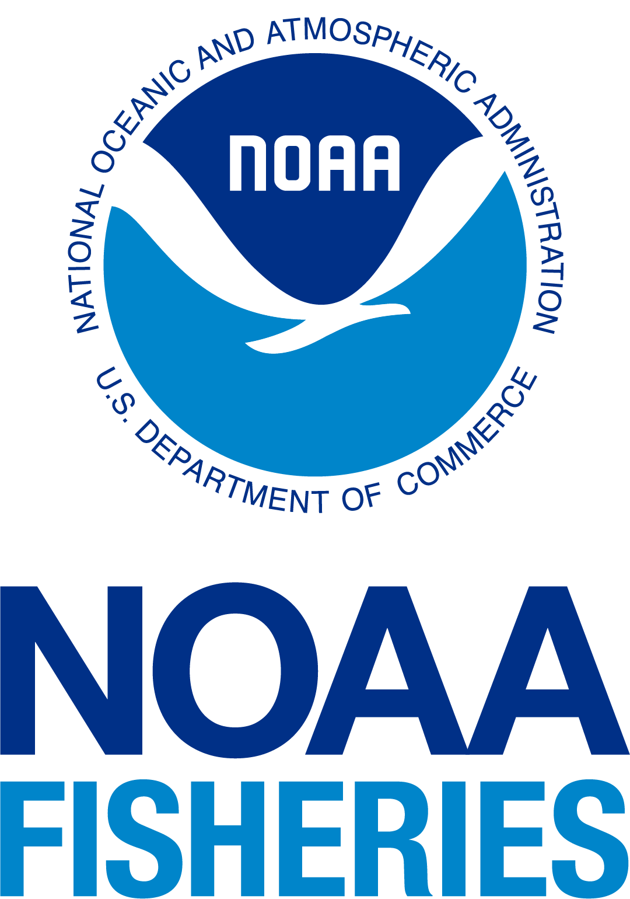
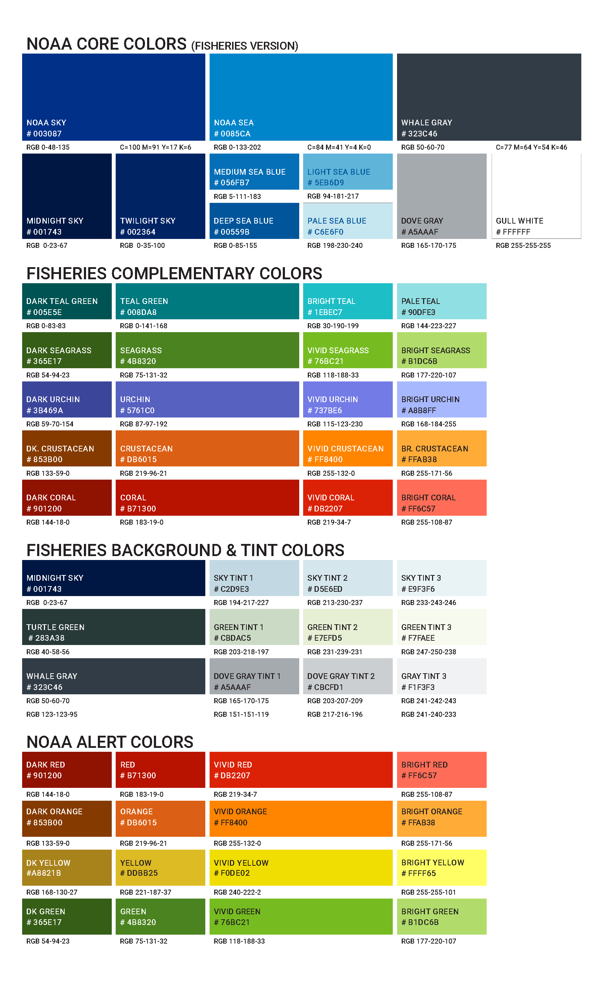

# NOAA-NMFS Brand Resources 

A collection of color palettes, logos, and icons. 
### Table of Contents
1. [Color Palettes](#color-palettes)
   - [Regional Color Set](#regional-color-set)
   - [Color Palettes - Primary](#color-palettes---primary)
   - [Color Palettes - Gradient](#color-palettes---gradient)
   - [NOAA Primary Palette](#noaa-primary-palette)
   - [Grays and Extended Palettes](#grays-and-extended-palettes)
2. [Comprehensive Color Guide](#comprehensive-color-guide)
3. [Logos](#logos)
   - [NOAA Logos](#noaa-logos)
   - [NOAA Logo Icons](#noaa-logo-icons)
4. [NOAA Fisheries Color Chart](#noaa-fisheries-color-chart-2023)
5. [NMFS Color Palette Python Script](./script/nmfs-color-palette-script.ipynb)
6. [Other Resources](#other-resources)

## Color Palettes
### Regional Color Set

| Region          | Color  Group | Base Color | Vivid Color| 
|-----------------|--------| --------------------------|-----------------------|
| National     | Oceans |   `#002364` |  `#0085CA`  |
| West Coast      |Waves |   `#00797F` |  `#1EBEC7`  |
| Southeast       | Seagrass |  `#4B8320` |  `#76BC21`  |
| Mid-Atlantic    | Urchin  | `#5761C0` |  `#737BE6` |
| Alaska          | Crustacean  |  `#DB6015` |  `#FF8400`  |
| Pacific Islands | Coral  |  `#B71300` |  `#DB2207` |

### Color Palettes - Primary 
| National      | West Coast     |  Southeast   | Mid-Atlantic    |  Alaska   | Pacific Islands | 
|-----------------|------------|----------------|------------------|------------|-------------------|
| Oceans      | Waves     |  Seagrass   | Urchin    |  Crustacean   | Coral | 
|   `#001743` |   `#005E5E` |   `#365E17` |  `#3B469A` |   `#853B00` |   `#901200` |
|   `#002364` |   `#00797F` |   `#4B8320` |  `#5761C0` |   `#DB6015` |   `#B71300` |
|   `#003087` |   `#1EBEC7` |   `#76BC21` |  `#737BE6` |   `#FF8400` |   `#DB2207` |
|   `#0085CA` |   `#90DFE3` |   `#B1DC6B` |   `#A8B8FF` |   `#ffab38` |   `#ff6c57` |
|   `#5EB6D9`                |              |                |                  |            |                   |
|   `#C6E6F0`              |              |                |                  |            |                   |

### Color Palettes - Gradient
### Oceans 
 
### Waves

### Seagrass

### Urchin

### Crustacean

### Coral

### NOAA Primary Palette

| Description          | Swatch | 
|----------------------|--------|
| NOAA Dark Blue  (Sky)     |   `#003087` |
| Body (Bird)      |   `#FFFFFF` |
| NOAA Light Blue   (water)   |   `#0085CA` |

### Grays and Extended Palettes

| Description          | Swatch | 
|----------------------|--------|
| Neutral Gray         |   `#646464` |
| Gray 85              |   `#7B7B7B` |
| Gray 65              |   `#9A9A9A` |
| Gray 30              |   `#E8E8E8` |
| Gray 15              |   `#D0D0D0` |
| Body Background      |   `#FFFFFF` |
| Body Text Color      |   `#181818` |

## Comprehensive Color Guide
 

## Logos
##### NOAA-emblem-usage-and-licensing
- [https://www.noaa.gov/noaa-emblem-usage-and-licensing](https://www.noaa.gov/noaa-emblem-usage-and-licensing)
- [https://www.noaa.gov/office-of-communication/about-noaa-emblem-and-logo](https://www.noaa.gov/office-of-communication/about-noaa-emblem-and-logo)

### NOAA Logos
| Logo                           | Preview                                                        |
|--------------------------------|----------------------------------------------------------------|
| NOAA Emblem                |  |
| NOAA Logo                      | |
| NOAA Fisheries Logo  (Horizontal)   | |
| NOAA Fisheries Logo (Horizontal-web)  | |
| NOAA Fisheries Logo (Vertical) |  |
| NOAA Fisheries Logo (Vertical-web) |  |
| NOAA Fisheries Open Science Logo |  |

## NOAA Logo Icons

| Icon                         | Preview                                                   |
|------------------------------|-----------------------------------------------------------|
| favicon.ico                  |        |
| favicon-16x16.png            |   |
| favicon-32x32.png            |   |
| noaa-icon-57x57.png          |    |
| noaa-icon-60x60.png          |    |
| noaa-icon-72x72.png          |    |
| noaa-icon-76x76.png          |    |     
| noaa-icon-114x114.png        |  |
| noaa-icon-120x120.png        |  |
| noaa-icon-144x144.png        |   |
| noaa-icon-152x152.png        |  |
| noaa-icon-180x180.png        |  |

### NOAA Fisheries Color Chart (2023)
 

### Other Resources
- https://nmfs-opensci.github.io/ResourceBook/content/templates.html
- https://noaa-fisheries.webflow.io/style-noaa-style-guide
- https://github.com/nmfs-fish-tools/nmfspalette
### Other Resources - (Internal-NOAA) 
- (Internal-NOAA) https://sites.google.com/noaa.gov/pifsc-intranet/science-operations/technical-services/graphics-services
- (Internal-NOAA) https://sites.google.com/noaa.gov/pifsc-intranet/publications-station
----------
#### Disclaimer
This repository is a scientific product and is not official communication of the National Oceanic and Atmospheric Administration, or the United States Department of Commerce. All NOAA GitHub project content is provided on an ‘as is’ basis and the user assumes responsibility for its use. Any claims against the Department of Commerce or Department of Commerce bureaus stemming from the use of this GitHub project will be governed by all applicable Federal law. Any reference to specific commercial products, processes, or services by service mark, trademark, manufacturer, or otherwise, does not constitute or imply their endorsement, recommendation or favoring by the Department of Commerce. The Department of Commerce seal and logo, or the seal and logo of a DOC bureau, shall not be used in any manner to imply endorsement of any commercial product or activity by DOC or the United States Government.

##### License
See the [LICENSE.md](./LICENSE.md) for details

##### NOAA-emblem-usage-and-licensing
- [https://www.noaa.gov/noaa-emblem-usage-and-licensing](https://www.noaa.gov/noaa-emblem-usage-and-licensing)
- [https://www.noaa.gov/office-of-communication/about-noaa-emblem-and-logo](https://www.noaa.gov/office-of-communication/about-noaa-emblem-and-logo)
